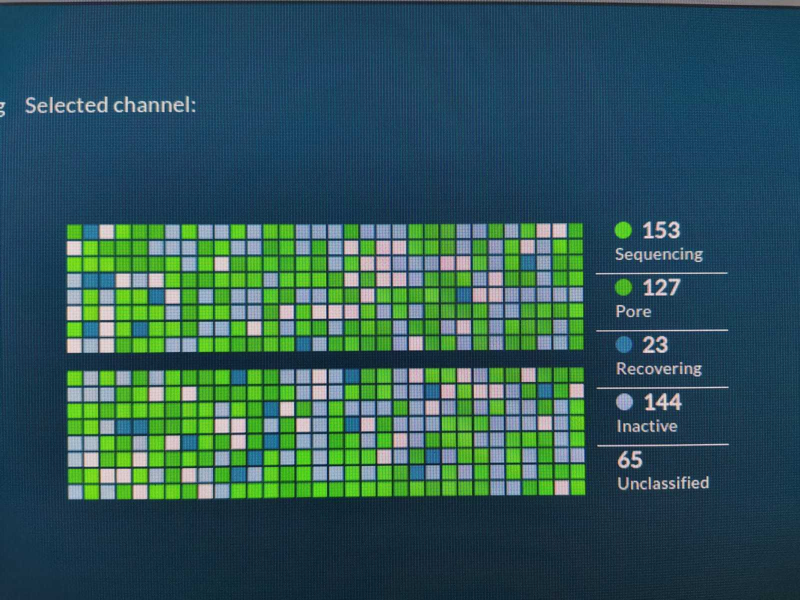
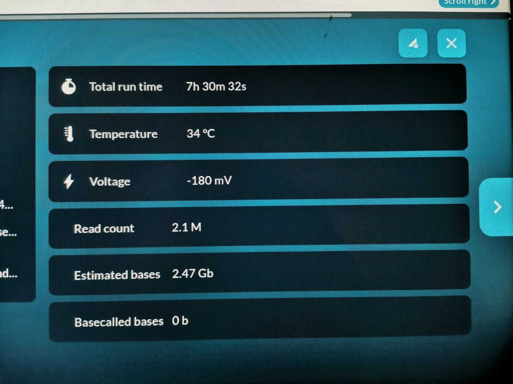
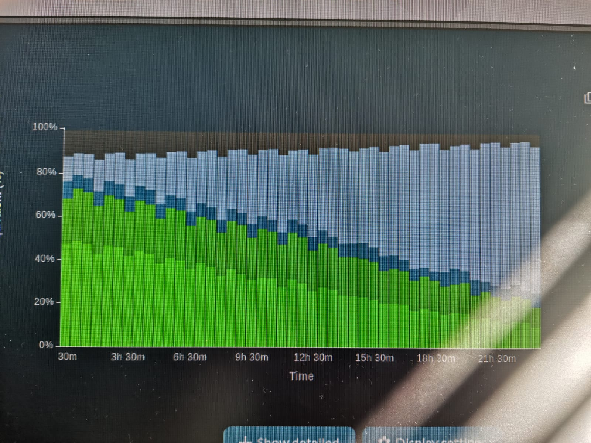
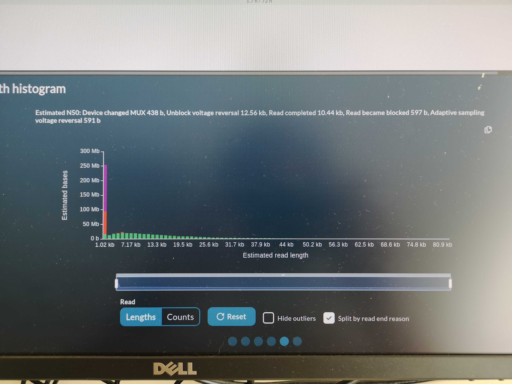
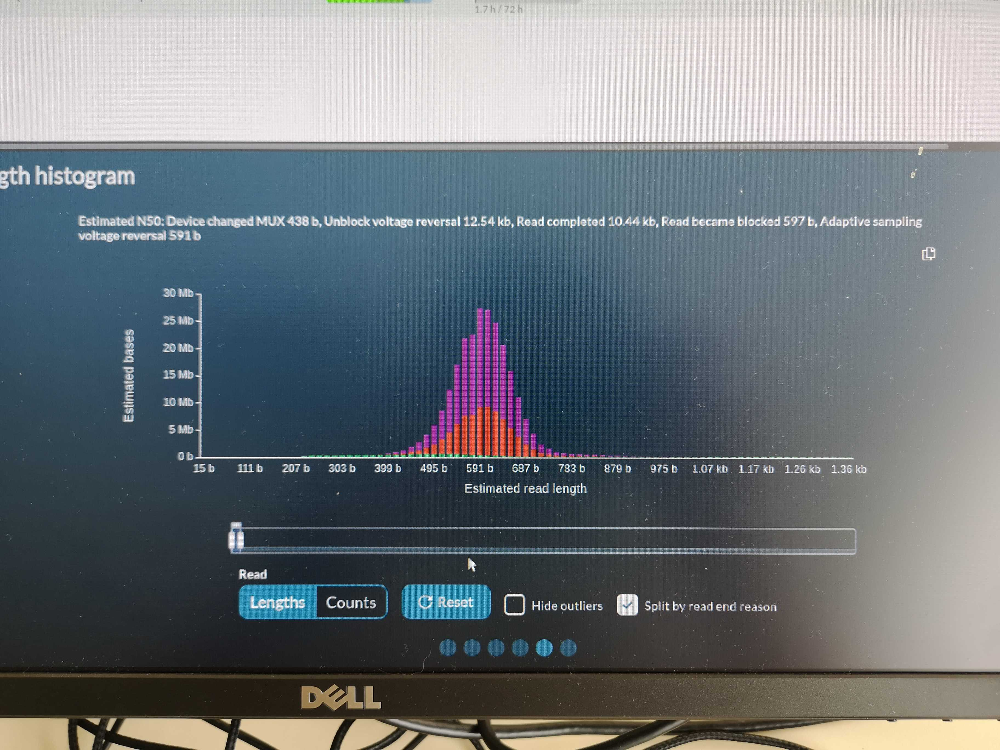
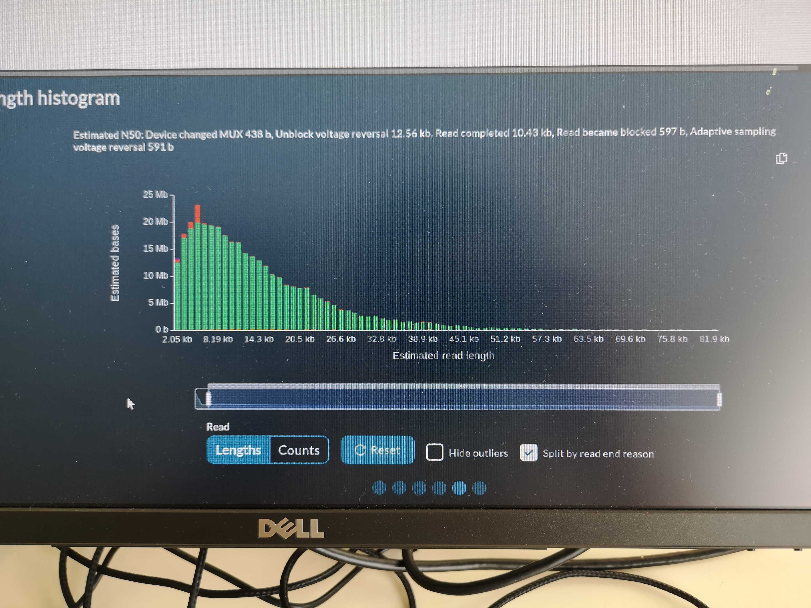
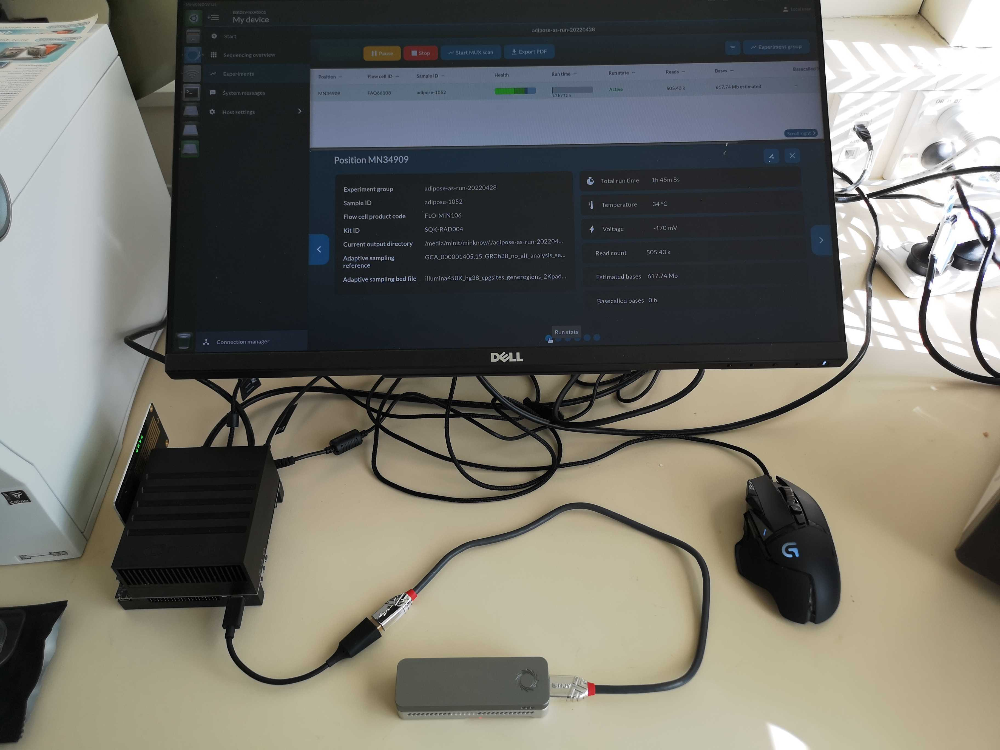
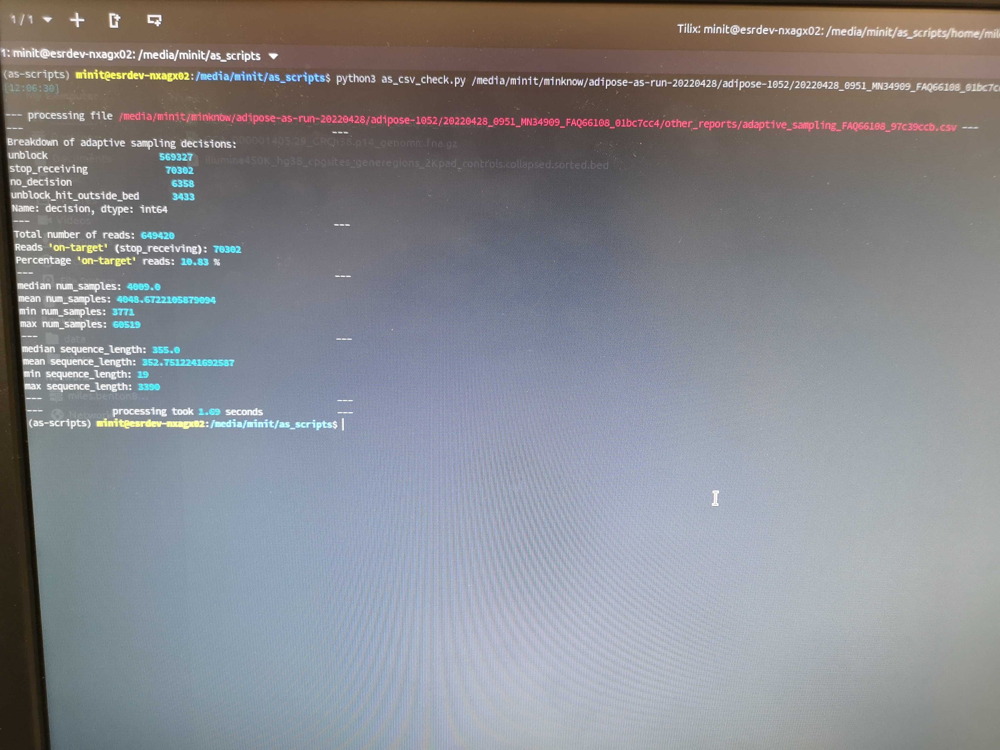

# First methylation adaptive sampling run

*Preliminary run*

// Author: Miles Benton
// Created: 2022/05/02 12:00:41
// Last modified: 2022/07/29 16:41:20

## Preface

This run was to explore what 10+ year old adipose DNA looked like when prepared and run on Nanopore MinION. Some initial notes:

* sample: subcut adipose tissue (preop)
* sampleID: 1052
* extraction method: Qiagen tissue kit
* library prep: rapid prep
* flowcell: R9.4.1

## Run metrics

Here are a few pics that we snapped during the sequencing run:










## Setting up software

### Bonito

```sh
cd /data/software/
conda deactivate
mkdir virenvs
cd virenvs/
python3 -m venv bonito
source bonito/bin/activate
pip install --upgrade pip
pip install ont-bonito
```

Check it's installed

```sh
bonito download --models --show
```

### modbam2bed

> A program to aggregate modified base counts stored in a modified-base BAM file to a bedMethyl file.

```sh
mamba create -n modbam2bed -c bioconda -c conda-forge -c epi2melabs modbam2bed
```

To use you just have to activate the env:

```sh
conda activate modbam2bed
```

Version:

```sh
$ modbam2bed --version
0.5.2
```

### IGV

If you haven't got IGV then just put it in there:

```sh
mamba install igv
```

If you need to activate the env:

```sh
conda activate modbam2bed
```

Then run with:

```sh
igv
```

### variant calling and phasing pipeline

Going to be using the ONT pipeline detailed here: https://labs.epi2me.io/gm24385-5mc-remora/

So set up requires nextflow and docker. Since both are already installed on Leviathan I'll just check for updates.

Update nextflow:

```sh
nextflow self-update
```

### whatshap

We can do the same for whatshap (https://whatshap.readthedocs.io/en/latest/installation.html):

```sh
conda deactivate
mamba create -n whatshap -c bioconda -c conda-forge whatshap nomkl
```

```sh
conda activate whatshap
whatshap --version
```

### ont-fast5-api

```sh
mamba create -n ontfast5api -c bioconda ont-fast5-api
```

## Sample processing

The basic flow of this processing pipeline is:

* basecalling / methylation calling (bonito/remora)
* variant calling / local alignment (Clair3)
* phasing (whatshap)

So first we'll get the data moving and then take care of the required software tools.

### Move the data

Use scp to transfer from the lab Xavier to Leviathan:

```sh
scp minit@10.1.91.29:/media/minit/minknow/adipose-as-run-20220428/adipose-1052/20220428_0951_MN34909_FAQ66108_01bc7cc4/fast5/* /data/ont_methylation/adipose_1052/run1/fast5/
```

### subset out on-target reads

How many reads are on target?

```sh
$ grep 'stop_receiving' other_reports/adaptive_sampling_FAQ66108_97c39ccb.csv | wc -l 
463822
```

Create a file to subset:

```sh
grep 'stop_receiving' other_reports/adaptive_sampling_FAQ66108_97c39ccb.csv > adipose_1052_run1_stop_receiving_reads.csv
```

Extract the read IDs out to a text file:

```sh
cut -d ',' -f5 adipose_1052_run1_stop_receiving_reads.csv > adipose_1052_run1_stop_receiving_read_ids.csv
```

Extract only on-target reads to their own fast5 files:

```sh
# activate env
conda activate ontfast5api
# create directory for extracted reads
mkdir ./fast5_extracted
# extract desired reads into their own fast5 files
fast5_subset --input ./fast5 --save_path ./fast5_extracted --read_id_list adipose_1052_run1_stop_receiving_read_ids.csv --recursive
```

### Basecalling and initial alignment

```sh
cd /data/ont_methylation/adipose_1052/run1
```

What's here?

```sh
$ tree -L 1
.
├── bam
├── barcode_alignment_FAQ66108_97c39ccb.tsv
├── duty_time_FAQ66108_97c39ccb.csv
├── fast5
├── final_summary_FAQ66108_97c39ccb.txt
├── other_reports
├── sequencing_summary_FAQ66108_97c39ccb.txt
├── summary.tsv
└── throughput_FAQ66108_97c39ccb.csv
```

Run bonito with SUP (super accuracy calling) and Remora for methylation calling:

```sh
# deactivate base conda env
conda deactivate
# hop into bonito virtual env
source /data/software/virenvs/bonito/bin/activate
# process the fast5 data
bonito basecaller dna_r9.4.1_e8_sup@v3.3 ./fast5_extracted/ --modified-bases 5mC \
  --reference /data/publicData/genomes/human/hg38/GCA_000001405.15_GRCh38_no_alt_analysis_set.mmi \
  --recursive --alignment-threads 16 | \
  samtools view -u | samtools sort -@ 8 > ./bam/adipose_1052_sup_modbases_GRCh38_20220503.bam
# index
samtools index ./bam/adipose_1052_sup_modbases_GRCh38_20220503.bam
```

  

### Variant calling

Pull the workflow down (only need to do this the once):

```sh
nextflow run epi2me-labs/wf-human-snp --help
```

Get the Clair3 models (http://www.bio8.cs.hku.hk/clair3/clair3_models/clair3_models.tar.gz)

```sh
wget http://www.bio8.cs.hku.hk/clair3/clair3_models/clair3_models.tar.gz
```

Run the pipeline:

```sh
nextflow run epi2me-labs/wf-human-snp \
  -resume \
  -w clair3_adipose_1052 \
  -profile standard \
  --model ./clair3_models/ont_guppy5 \
  --bam ./bam/adipose_1052_sup_modbases_GRCh38_20220503.bam \
  --bed ./bed/illumina450K_hg38_cpgsites_generegions_2Kpad_controls_noY.collapsed.sorted.bed \
  --ref /data/publicData/genomes/human/hg38/GCA_000001405.15_GRCh38_no_alt_analysis_set.fasta \
  --out_dir vcf_adipose_1052 \
  --phase_vcf
```

### Phasing with whatshap

```sh
# load env
conda activate whatshap
# run the phasing
whatshap haplotag \
    --ignore-read-groups \
    --output ./bam/adipose_1052_sup_modbases_GRCh38_20220503.hp.bam \
    --reference /data/publicData/genomes/human/hg38/GCA_000001405.15_GRCh38_no_alt_analysis_set.fasta \
    ./vcf_adipose_1052/all_contigs.vcf.gz ./bam/adipose_1052_sup_modbases_GRCh38_20220503.bam
# index
samtools index ./bam/adipose_1052_sup_modbases_GRCh38_20220503.hp.bam
```

### modbam2bed

```sh
for HP in 1 2; do
    modbam2bed \
        -e -m 5mC --cpg -t 10 --haplotype ${HP} \
        /data/publicData/genomes/human/hg38/GCA_000001405.15_GRCh38_no_alt_analysis_set.fasta \
        ./bam/adipose_1052_sup_modbases_GRCh38_20220503.hp.bam \
        | bgzip -c > ./bed/adipose_1052_bonito.hp${HP}.cpg.bed.gz
done;
```
